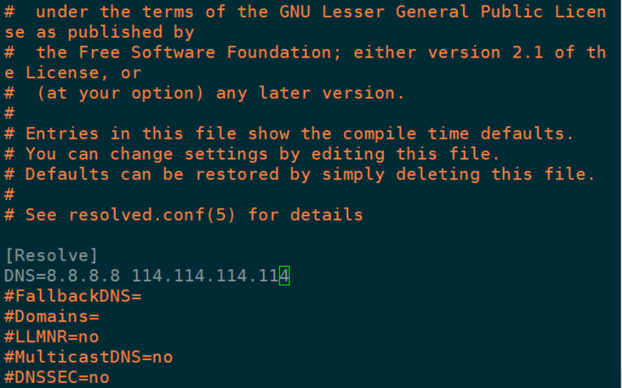

[TOC]

### U盘的准备

1. 登录官方网站`https://www.openmediavault.org/`下载最新稳定版本
2. 登录`etcher`项目官网`https://www.balena.io/etcher`下载安装`etcher`
3. 通过`etcher`制作U盘系统安装盘

### omv(openmediavault)系统的安装

通过U盘启动主机

1. `Select a language`: 选择第一个`C - No localiztion`
2. `Select your location`: 选择`Asia`->`China`
3. `Configure the keyboard`: 选择`Chinese`
4. `Configure the networ`: 如果有多个网口会弹出这个设置，选择接入网线的网口
5. `Configure the network`: 设置主机名输入`omv`->设置域名`local`
6. `Set up users and passwords`: 设置root密码，这里直接按回车跳过密码设置，确认密码页面再次按回车跳过，这样就禁用了root账户。接下来提示创建管理系统的普通账户，先输入全名`Hare`->用户名`hare`->密码`ganggang1314`->确认密码`ganggang1314`
7. `partition disks`: 由于有多个存储设备，系统安全提示，这里确认继续。选择系统安装的存储盘。系统自动分区，确认进入下一步
8. `Install the system`: 系统自动安装
9. `Configure the package manager`: 包管理器使用的源设置，`China`->选择合适的镜像源`mirrors.163.com`，接下来系统提示设置代理，直接回车跳过不使用
10. `Configuring apt`: 系统安装
11. `Configuring resolvconf`: 系统安装完成提示拔出U盘重启电脑
12. 登录系统后首先更新软件源: `sudo apt update`
13. 安装`fish`终端，`sudo apt install fish`
14. 拔掉U盘重启系统
15. 接下来就可以通过`http://omv.local`来访问`omv`页面了, 或者通过`ip`访问(可以通过`fing`手机应用来查找`ip`)
16. 管理账号: `admin`, 密码: `openmediavault`

### omv全面改用国内软件源

首先需要上omv上安装插件`openmediavault-omvextrasorg_latest_all5.deb`

```shell
# 下载安装包
wget http://omv-extras.org/openmediavault-omvextrasorg_latest_all5.deb
# 安装
dpkg -i openmediavault-omvextrasorg_latest_all4.deb
# 更新
apt-get update
```


#### 1. 编辑`sources.list`

   ```shell
# 备份配置文件
sudo cp /etc/apt/sources.list /etc/apt/sources.list.bak
# 清空配置文件
sudo sh -c 'echo > /etc/apt/sources.list'
# 编辑配置文件
sudo vim /etc/apt/sources.list
   ```

   复制并粘贴以下内容：

   ```
deb http://mirrors.tuna.tsinghua.edu.cn/debian/ buster main
# deb-src http://mirrors.tuna.tsinghua.edu.cn/debian/ buster main

deb http://mirrors.tuna.tsinghua.edu.cn/debian-security buster/updates main contrib non-free
# deb-src http://mirrors.tuna.tsinghua.edu.cn/debian-security buster/updates main contrib non-free

deb http://mirrors.tuna.tsinghua.edu.cn/debian/ buster-updates main contrib non-free
# deb-src http://mirrors.tuna.tsinghua.edu.cn/debian/ buster-updates main contrib non-free
   ```

#### 2. 编辑 openmediavault-kernel-backports.list

```shell
# 备份配置文件
sudo cp /etc/apt/sources.list.d/openmediavault-kernel-backports.list /etc/apt/sources.list.d/openmediavault-kernel-backports.list.bak
# 清空配置文件
sudo sh -c 'echo > /etc/apt/sources.list.d/openmediavault-kernel-backports.list'
# 编辑配置文件
sudo vim /etc/apt/sources.list.d/openmediavault-kernel-backports.list
```

复制并粘贴以下内容：

```
deb https://mirrors.tuna.tsinghua.edu.cn/debian buster-backports main contrib non-free
```

#### 3. 编辑 openmediavault.list

```shell
# 备份配置文件
sudo cp /etc/apt/sources.list.d/openmediavault.list /etc/apt/sources.list.d/openmediavault.list.bak
# 清空配置文件
sudo sh -c 'echo > /etc/apt/sources.list.d/openmediavault.list'
# 编辑配置文件
sudo vim /etc/apt/sources.list.d/openmediavault.list
```

复制并粘贴以下内容：

```
deb https://mirrors.tuna.tsinghua.edu.cn/OpenMediaVault/public/ usul main
```

#### 4. 编辑 omvextras.list

```shell
# 备份配置文件
sudo cp /etc/apt/sources.list.d/omvextras.list /etc/apt/sources.list.d/omvextras.list.bak
# 清空配置文件
sudo sh -c 'echo > /etc/apt/sources.list.d/omvextras.list'
# 编辑配置文件
sudo vim /etc/apt/sources.list.d/omvextras.list
```

复制并粘贴以下内容：

```
deb https://mirrors.tuna.tsinghua.edu.cn/OpenMediaVault/openmediavault-plugin-developers/usul buster main
deb [arch=amd64] https://mirrors.tuna.tsinghua.edu.cn/docker-ce/linux/debian buster stable
deb http://linux.teamviewer.com/deb stable main
```

### 目录的分配思路

```
NAS:/
├─appData
│  ├─aria2
│  ├─jellyfin
│  ├─mariadb
│  ├─nextcloud
│  │  ├─config
│  │  └─data
│  └─redis
├─downloads
├─home
├─movies
├─music
├─share
└─television
```


### omv基本设置

挂载硬盘

添加共享文件夹

开启`SMB`服务

添加`SMB`共享文件夹

添加用户，需要重置密码来更新`SMB`服务的用户权限

启用用户主目录

### docker设置及镜像推荐

```shell
sudo docker pull linuxserver/mariadb
sudo docker pull phpmyadmin/phpmyadmin
sudo docker pull adminer
sudo docker pull redis
sudo docker pull linuxserver/nextcloud
sudo docker pull p3terx/aria2-pro
sudo docker pull jellyfin/jellyfin
sudo docker pull linuxserver/transmission
```

### docker 部署`mariadb/mysqldb`数据库

```dockerfile
---
version: "2.1"
services:
  mariadb:
    image: linuxserver/mariadb
    container_name: mariadb
    environment:
      - PUID=1000
      - PGID=100
      - MYSQL_ROOT_PASSWORD=ROOT_ACCESS_PASSWORD
      - TZ=Asia/Shanghai
    volumes:
      - mariadb_data:/config
    ports:
      - 3306:3306
    networks:
      - mynet
    restart: unless-stopped
  
  adminer:
    image: adminer
    container_name: adminer
    environment:
      - ADMINER_DEFAULT_SERVER=mariadb
    ports:
      - 8080:8080
    networks:
      - mynet
    restart: unless-stopped

networks:
  mynet:
    external:
      name: mynet
```

### docker 部署`nextcloud`数据库

```dockerfile
---
version: "2.1"
services:
  nextcloud:
    image: linuxserver/nextcloud
    container_name: nextcloud
    environment:
      - PUID=1000
      - PGID=1000
      - TZ=Asia/Shanghai
    volumes:
      - /path/to/appdata:/config
      - /path/to/data:/data
    networks:
      - mynet
    ports:
      - 443:443
    restart: unless-stopped

networks:
  mynet:
    external:
      name: mynet
```

镜像跑起来后，可能遇到的问题：

**登录主页进行设置初始化时，`nginx`超时**

这里需要提前设置nginx，超时时间改大一些

如果已经出现页面超时报错，重新初始化时已经创建用户，需要更换一个新的用户继续。但是我这里第二次填写的新用户并没有被创建

**需要添加信任域名**


### 部署jellyfin

需要访问国外资源才可能获取影视墙，默认端口为8096

### 部署aria2

```dockerfile
---
version: "2.1"
services:
  aria2:
    image: p3terx/aria2-pro
    container_name: aria2
    environment:
      - PUID=1000
      - PGID=1000
      - RPC_SECRET=<TOKEN>
      - TZ=Asia/Shanghai
      - LISTEN_PORT=6888
    volumes:
      - <path to aria2-config>:/config
      - <path to aria2-downloads>:/downloads
    ports:
      - 6800:6800
      - 6888:6888
      - 6888:6888/udp
    networks:
      - mynet
    restart: unless-stopped

networks:
  mynet:
    external:
      name: mynet
```

### 部署transmission

```dockerfile
---
version: "2.1"
services:
  transmission:
    image: linuxserver/transmission
    container_name: transmission
    environment:
      - PUID=1000
      - PGID=1000
      - TZ=Asia/Shanghai
      - TRANSMISSION_WEB_HOME=/combustion-release/ #optional
      - USER=username #optional
      - PASS=password #optional
      - WHITELIST=iplist #optional
    volumes:
      - <path to data>:/config
      - <path to downloads>:/downloads
      - <path to watch folder>:/watch
    ports:
      - 9091:9091
      - 51413:51413
      - 51413:51413/udp
    networks:
      - mynet
    restart: unless-stopped

networks:
  mynet:
    external:
      name: mynet
```

### 部署Gogs

```do
---
version: "2.1"
services:
  gogs:
    image: gogs/gogs
    container_name: gogs
    volumes:
      - <path to data>:/data
    ports:
      - 10022:22
      - 10080:3000
    networks:
      - mynet
    restart: unless-stopped

networks:
  mynet:
    external:
      name: mynet
```

### debain终端中文显示乱码

```bash
# 启动终端
apt-get install locales
# 重新配置LOCALE
dpkg-reconfigure locales
# 运行LOCALE命令检查当前的LOCALE环境
locale
```

### linux dns 总是被重置

根据一般思路会去更改resolv.conf的内容，但是你发现只要重启机器你设置的nameserver还是会被改成127.0.0.53

因此，需要去/etc/systemd/resolved.conf修改DNS服务器的地址如下：

```
#  This file is part of systemd.
#
#  systemd is free software; you can redistribute it and/or modify it
#  under the terms of the GNU Lesser General Public License as published by
#  the Free Software Foundation; either version 2.1 of the License, or
#  (at your option) any later version.
#
# Entries in this file show the compile time defaults.
# You can change settings by editing this file.
# Defaults can be restored by simply deleting this file.
#
# See resolved.conf(5) for details

[Resolve]
DNS=8.8.8.8 114.114.114.114
#FallbackDNS=
#Domains=
#LLMNR=yes
#MulticastDNS=yes
#DNSSEC=allow-downgrade
#DNSOverTLS=no
#Cache=yes
#DNSStubListener=yes
#ReadEtcHosts=yes
```



然后执行：

\###重启systemd-resolved
service systemd-resolved restart
就可以了